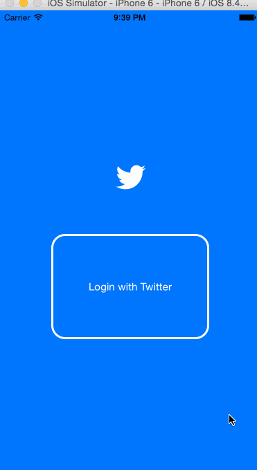

# RottenTomatoes Box Office Demo

(Sample of your weekly project submission README)

This is an iOS demo application for twitter App [Twitter API](https://dev.twitter.com/rest/public).

Time spent: 25 hours spent in total

Completed user stories:

 * [x] Required: User can view a list of latest box office movies including title, cast and tomatoes rating
 * [x] Required: User can click on a movie in the list to bring up a details page with additional information such as synopsis
 * [x] Optional: Placeholder image is used for movie posters loaded in from the network

    Hamburger menu
    * [x] Dragging anywhere in the view should reveal the menu.
        * [x] The menu should include links to your profile, the home timeline, and the mentions view.
        * [x] The menu can look similar to the LinkedIn menu below or feel free to take liberty with the UI.
        * [x] Tapping on a user image should bring up that user's profile page
        * [x] Optional: Menu background image
    Profile page
        * [x] Tapping on a user image should bring up that user's profile page
        * [x] Contains the user header view
        * [x] Contains a section with the users basic stats: # tweets, # following, # followers
        * [x] Optional: Implement the paging view for the user description.
        * [x] Optional: Pulling down the profile page should blur and resize the header image.
        * [x] Optional: Personal photo and personal profile.
    Account
        * [x] Account Page

Notes:

Spent some time making the UI work across multiple phone resolutions by playing around with the RelativeLayout.

Walkthrough of all user stories:

GIF created with [LiceCap](http://www.cockos.com/licecap/).